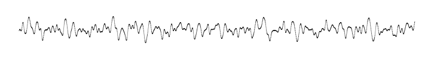
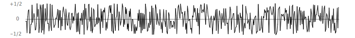
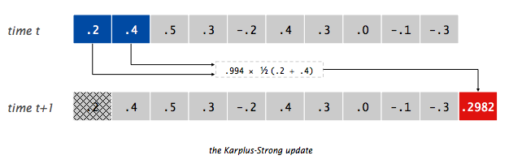
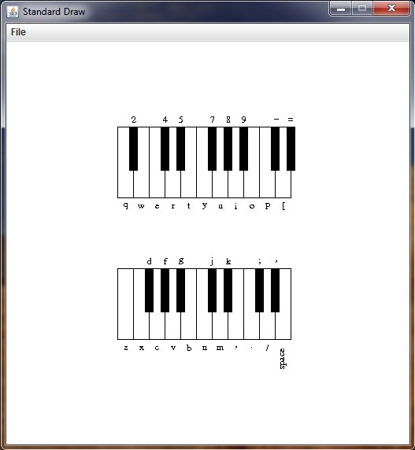

# Homework 6, Part A: Doubly Linked Lists (in pairs)

Here, you will create your own implementation of a doubly linked list.
A doubly linked list is a linked list in which every node maintains a reference to the item next in the list,
**as well as** the item previous in the list:

<center>

</center>


## Task 0: Getting Settled

Copy over the `List<T>` interface below. Your linked list should implement this interface.

**The List Interface.** 

```java
public interface List<T> {
    /**
     * Checks if the list is empty
     * 
     * @return true if the list is empty, false otherwise
     */
    public boolean isEmpty();
    
    /**
     * Returns the size of the list
     * 
     * @return the size (or length) of the list
     */
    public int size();

    /**
     * Returns the element at the specified position from the list
     *
     * @param index of the element in the list
     * @return the element to be returned
     */
    public T get(int position);

    /**
     * Inserts an element at the given position in the list.
     * 
     * @param the index of the element to be added
     * @param the element to be added
     */
    public void insert(int position, T element);
    
    /**
     * Removes the element at the specified position from the list
     * 
     * @return the element to be returned
     */
    public T remove(int position);

    /**
     * Generates a String representation of list; 
     * first element in the representation is the front
     * 
     * @return a String representation of the list
     */
    public String toString();
}
```


## Task 1: Doubly Linear Node

Create a class, `DoublyLinearNode<T>`, to represent a node in your linked list.
You can follow the `LinearNode` from the class for inspiration.


## Task 2: Implementing the Doubly Linked list

Create a class, `DoublyLinkedList<T>` that uses your `DoublyLinearNode<T>` to implement the `List<T>` interface.
Before implementing each method, **draw a memory diagram** to make sure you know what pointer manipulations you plan to use.
You may find it helpful to draw multiple versions of these memory diagrams corresponding to lists of various sizes.

Additionally, in your implementation, please:
* Store both a reference to the front of the list **and the rear**.
* Update these references appropriately when inserting/removing.
* Use the reference to rear for fast get/insertion/removal from the very end of the list (i.e. if someone wants to operate on the last element of the list, they shouldn't have to iterate over the whole list to find it).

**Hint:** For both *insert* and *remove*, you may want to break your code into several cases:
* When the list is empty
* When removing from a list of size 1
* When inserting/removing at the front
* When inserting/removing at the rear

**Hint:** Feel free to throw RuntimeExceptions when anything goes `wrong`, and no need to work in javafoundations for this particular exercise. 


## Task 3: Testing

Please test your `DoublyLinkedList<T>` in a main method belonging to the same class.
You can save your tests in `DoublyLinkedListTests.txt`.
There's no need to test your `DoublyLinearNode<T>`.


<br/>
# Homework 6, Part B: Community learning (in pairs)

In class, on Friday, we worked on answering a set of questions. In this task, we will work on a process of iterative feedback, to get to deeper understanding on these topics as a community. 

1. In these [slides](https://docs.google.com/presentation/d/1VPym6gCCoczmGka03ISmpVLgsQykf3vB2WJY_l3Cj48/edit?slide=id.g38df65b3a91_25_15#slide=id.g38df65b3a91_25_15), find your group number for this homework - note, there are two slides per group.
2. Come up with a final answer for the questions assigned to your group by **Friday 10/24 at 5pm**. Make sure to have clear and complete sentences, and appropriate terminology. 
3. Individually, find the questions you asked, and provide feedback to the answers you received by **Monday 10/27 at 10pm**. Include these as comments in the slides themselves. 
4. As a group, come up with a final answer to the questions you've been assigned in a new google document, that contains **your name and your partner's name in the title**. Share this google doc with me and submit it to Gradescope by the deadline included in our schedule. 

<br/>

# Homework 6, Part C: While my guitar weeps (individual)

## Learning Goals

* Extend a known Data Structure (Queue), to create a new, special-purpose Data Structure (BoundedQueue)
* Use this special-purpose Data Structure in an simulation of a guitar playing music

## Exercise: While My Guitar Gently Weeps

In this exercise, you will learn how to simulate the plucking of a guitar string with the Karplus-Strong algorithm. Play the video below to see a visualization of the algorithm. If your browser won't play the video below, you can right-click on it and save it to your Desktop to play it from there.


<p><center>
<video controls="controls" width="760" height="220" name="Stairway to Heaven" src="_images/figs/StairwayToHeaven.mov"></video>
</center></p>

When a guitar string is plucked, the string vibrates and creates sound. The length of the string determines its fundamental frequency of vibration. We model a guitar string by sampling its displacement (a real number between -1/2 and +1/2) at N equally spaced points (in time), where N equals the sampling rate (44,100) divided by the fundamental frequency (rounding the quotient up to the nearest integer).

<!--
When a guitar string is plucked, the string vibrates and creates sound. These are some terms regarding the physics about how guitars make noise, and our simulation of it in this exercise:
* When a guitar string is at rest, it is at its **equilibrium position**.
* When a string is strummed, it vibrates oscillating from side to side. At any point, the distance of the string from its equilibrium position is called the **displacement** and it changes constantly. We will measure it as a real number between -1/2 and +1/2.
* The **sampling rate** indicates how many samples of the displacement we take in a second. In out simulation the sampling rate **(N)** will be 44,100 (samples per second).
* The **fundamental frequency** of the vibration is determined by the string length. We model a guitar string by dividing its displacement by the fundamental frequency (rounding the quotient up to the nearest integer). We will take N such samples per second.

 at **N** equally spaced points (in time), where **N** equals the **sampling rate** (44,100) divided by the fundamental frequency (rounding the quotient up to the nearest integer).
-->


**Plucking the string.** The excitation of the string contains energy at any frequency. We simulate the excitation with <em>white noise</em>:
set each of the <em>N</em> displacements to a random real number between -1/2 and +1/2.



**The resulting vibrations.** After the string is plucked, the string vibrates. The pluck causes a displacement which spreads wave-like over time. The Karplus-Strong algorithm simulates this vibration by maintaining a <em>bounded-queue</em> of the <em>N</em> samples: the algorithm repeatedly dequeues the first sample from the bounded queue and enqueues the average of the dequeued sample and the front sample in the queue, scaled by an <em>energy decay factor</em> of 0.994.




### Task 0

Download this [starting code](static_files/Guitar.zip) that will allow you to complete the tasks below.


### Task 1

Write a **BoundedQueue.java** class that implements a **bounded queue ADT**. A bounded queue is a queue with a **maximum capacity**: no elements can be enqueued when the queue is full to its capacity. The BoundedQueue class should *inherit* from the `javafoundations.CircularArrayQueue` class, given in the starting code.

Your *BoundedQueue.java* file should contain implementations for the following methods:

  * A **constructor** that takes an integer argument, which is the capacity of the bounded queue
  * A predicate `isFull()` that indicates whether the bounded queue is at capacity or not
  * An `enqueue()` method that overrides the `javafoundations.CircularArrayQueue`'s `enqueue()` method so that it only enqueues an element if the queue is not at capacity.

You should not add any more **instance** methods to this class implementation. But, of course, you should be providing evidence of testing your implementation in the `main()`.

Make sure you test this class before continuing to the next task.

### Task 2

Write a `GuitarString` class that models a vibrating guitar string according to the following contract:

  * <code>public GuitarString(double frequency);</code>
  The **constructor** creates a guitar string of the given *frequency*, using a sampling rate of 44,100. It initializes a bounded queue of the desired capacity *N* (sampling rate divided by the *frequency*, rounded up to the nearest integer), and fills the bounded queue with *N* zeros to model a guitar string at rest.<br>

  * <code>public void pluck();</code>
  The **pluck()** method replaces the *N* samples in the bounded queue with *N* random values between -0.5 and +0.5:<br>

  * <code>public double sample();</code>
  The **sample()** method returns the value of the item at the front of the bounded queue:<br>

  * <code>public void tic();</code>
  The **tic()** method applies the Karplus-Strong algorithm, i.e., it deletes the sample at the front of the bounded queue and adds to the end of the bounded queue the average of the deleted sample and the sample at the front of the bounded queue, multiplied by the energy decay factor of 0.994:


### Task 3

Now you should be ready to test your code from the previous tasks. Compile and run the provided **GuitarHeroine** application. If you have successfully completed the previous tasks, then when you run the application, a window should appear as follows:



Now, you can make sweet music. By pressing any of the keys on your computer keyboard corresponding to the notes as illustrated in the piano keyboard image, you can simulate plucking a guitar string for that note (make sure that your computer's sound is not muted).

### What to submit
In Gradescope submit the following files:

1. The `BoundedQueue.java` file
2. Your testing transcript (`BoundedQueue.txt`) for BoundedQueue class
3. The `GuitarString.java` file


<!--
# Homework 6, Part B: Merge-Sorting a Linked List

In this assignment, we will walk you through implementing merge sort for a linked list.
In addition to the coding problems, we ask you to answer **open-response questions** and submit your answers in a file called `Answers.txt`.


<br/>


## Task 0: Creating your BlueJ project

Create a BlueJ project with the following starter code.

`LinearList.java`:
```java
public interface LinearList<T> {
    public boolean isEmpty();
    public int size();
    public T get(int position);
    public void insert(int position, T element);
    public T remove(int position);
    public String toString();
}
```

`LinearNode.java`:
```java
public class LinearNode<T> {
   private LinearNode<T> next;
   private T element;

   public LinearNode() {
      next = null;
      element = null;
   }

   public LinearNode(T elem) {
      next = null;
      element = elem;
   }

   public LinearNode<T> getNext() {
      return next;
   }

   public void setNext(LinearNode<T> node) {
      next = node;
   }

   public T getElement() {
      return element;
   }

   public void setElement(T elem) {
      element = elem;
   }
}
```

`LinkedList.java`:
```java
public class LinkedList<T> implements LinearList<T> {
    protected LinearNode<T> front;
    protected int count;
    
    public LinkedList() {
        this.front = null;
        this.count = 0;
    }
    
    public boolean isEmpty() {
        return this.count == 0;
    }
    
    public int size() {
        return this.count;
    }

    protected LinearNode<T> getNode(int position) {
        if (position < 0 || position >= this.count) {
            throw new RuntimeException(
                "Asking for element at index " + position 
                + " in a list of size" + this.count
            );
        }
        
        LinearNode<T> current = this.front;
        for (int i = 0; i < position; i++) {
            current = current.getNext();
        }
        
        return current;
    }
    
    public T get(int position) {
        LinearNode<T> node = this.getNode(position);
        if (node == null) {
            return null;
        }
        
        return node.getElement();
    }
    
    public void insert(int position, T element) {
        LinearNode<T> node = new LinearNode<T>(element);
        
        if (position == 0) {
            node.setNext(front);
            front = node;
        } else {
            LinearNode<T> before = this.getNode(position - 1);
            node.setNext(before.getNext());
            before.setNext(node);
        }
        
        this.count++;
    }
    
    public T remove(int position) {
        LinearNode<T> current;
        if (position == 0) {
            current = front;
            front = front.getNext();
        } else {
            LinearNode<T> before = this.getNode(position - 1);
            current = before.getNext();
            before.setNext(current.getNext());
        }  
        
        this.count--;
        return current.getElement();
    }

    public String toString() {
        String s = "[ ";
        
        LinearNode<T> current = this.front;
        for (int i = 0; i < this.size(); i++) {
            s += current.getElement().toString() + ", ";
            current = current.getNext();
        }
        
        return s + "]";
    }
}
```

Then, answer:
* Which instance variables/methods are `protected`?
* Why would we choose to make them `protected` instead of `private` for this assignment?


<br/>

## Task 1

**Instructions.** Create a class, `SortableLinkedList`, with the following header:

```java
public class SortableLinkedList<T extends Comparable<T>> extends LinkedList<T> {
  ...
}
```

This is the class in which you will implement your sortable linked list.

**Answer.**
* What does each part of the syntax in the class header mean?
* Why do we mention `Comparable<T>` in the class header?


<br/>

## Task 2

**Instructions.** Implement a helper method with the following header:
```java
private SortableLinkedList<T> split() {
  ...
}
```

This method cuts `this` linked list into two halves.
The left half should remain in `this`, while the right half should be returned as its own linked list.
This method should take no more than O(N) time.

**Tests.** After implementing this method, **test it** in the `main` method of the same file.
You can store the results of all of your testing in `SortableLinkedlistTesting.txt`.
We highly recommend you **do not** continue without confidence this method words correctly.


<br/>

## Task 3

**Instructions.** Implement a helper method with the following header:
```java
private void reverse() {
  ...
}
```

As the name suggests, this method should reverse the order of the nodes in the linked list.
This method should take no more than O(N) time.

**Hint.** You should be able to do this with a single while loop and without any additional data structures.
If you wish, you may use a Queue or Stack from the Java API (only using the appropriate methods).

**Tests.** As before, after implementing this method, **test it** in the `main` method of the same file.
We highly recommend you **do not** continue without confidence this method words correctly.


<br/>

## Task 4

**Instructions.** Implement a helper method with the following header:
```java
private void merge(SortableLinkedList<T> right) {
  ...
}
```

This method takes in a second linked list, `right`, and merges into `this` linked list, using merge-sort's merge algorithm.
This method should take no more than O(N) time.

**Hints.**
* You may want to create a **new linked list** to contain the merged elements. Then, you can assign its contents to `this`.
* You should do this **without** any pointer manipulation, only relying on other methods of the linked list.
* Consider using the helper methods you've already implemented.

**Tests.** As before, after implementing this method, **test it** in the `main` method of the same file.
We highly recommend you **do not** continue without confidence this method words correctly.


<br/>

## Task 5

**Instructions.** Finally, implement merge sort:
```java
public void sort() {
  ...
}
```

**Hint.** Every helper method above you haven't yet used will be helpful here.

**Tests.** Don't forget to test your sorting algorithm!
For ease of checking your code, you may want to sort something simple, like integers, instead of strings:
```
SortableLinkedList<Integer> l = new SortableLinkedList<Integer>();
l.insert(0, 0);
...
```


<br/>


# Submission Checklist

* You submitted **all** `.java` files and all `.txt` files.
* Your files are named **exactly** as in the homework specification, *including file extensions*.
* You tested **every possible** pathway in your code.
* You signed every class (or file) with `@author` and `@version`, accompanied by a description of what the class does.
* You wrote javadoc for every function, which includes `@param` and `@return`.
* You wrote inline comments explaining the logic of your code.


--!>
<!--


# Homework 6: Stacks and Linked Lists


## Learning Goals

* Gaining experience with using multiple implementations for the same task
* Work with [Java's Stack class](https://docs.oracle.com/javase/8/docs/api/java/util/Stack.html)
* Work with [Java's LinkedList class](https://docs.oracle.com/javase/8/docs/api/java/util/LinkedList.html)
* Think about time complexity and compare different programs based on it

## Three ways to store a collection

### Task 1: CDcollection using a Stack and a LinkedList

Recall the very first collection we saw in this class, the `CDcollection`. It uses an array to keep track of the `CD`s in someone's possession. A client program, `Tunes`, acts as a driver for the `CDcollection`. In this exercise you will write two more implementations for managing a collection of CDs:
  1. `CDcollection_Stack`, which will use a Stack to manage the collection, and
  2. `CDcollection_LinkedList` which will use a LinkedList to do so.

Create a BlueJ project, adding the three files below to it. Review the code to refresh your memory on how the application works.

`CD.java`:
```java
//********************************************************************
//  CD.java       Java Foundations
//
//  Represents a compact disc.
//********************************************************************

import java.text.NumberFormat;

public class CD
{
   private String title, artist;
   private double cost;
   private int tracks;

   //-----------------------------------------------------------------
   //  Creates a new CD with the specified information.
   //-----------------------------------------------------------------
   public CD (String name, String singer, double price, int numTracks)
   {
      title = name;
      artist = singer;
      cost = price;
      tracks = numTracks;
   }

   //-----------------------------------------------------------------
   //  Returns a string description of this CD.
   //-----------------------------------------------------------------
   public String toString()
   {
      NumberFormat fmt = NumberFormat.getCurrencyInstance();

      String description;

      description = fmt.format(cost) + "\t" + tracks + "\t";
      description += title + "\t" + artist;

      return description;
   }
}
```

`CDCollection.java`:
```java
//********************************************************************
//  CDCollection.java       Java Foundations
//
//  Represents a collection of compact discs.
//********************************************************************

import java.text.NumberFormat;

public class CDCollection
{
   private CD[] collection;
   private int count;
   private double totalCost;

   //-----------------------------------------------------------------
   //  Constructor: Creates an initially empty collection.
   //-----------------------------------------------------------------
   public CDCollection ()
   {
      collection = new CD[100];
      count = 0;
      totalCost = 0.0;
   }

   //-----------------------------------------------------------------
   //  Adds a CD to the collection, increasing the size of the
   //  collection if necessary.
   //-----------------------------------------------------------------
   public void addCD (String title, String artist, double cost,
                      int tracks)
   {
      if (count == collection.length)
         increaseSize();

      collection[count] = new CD (title, artist, cost, tracks);
      totalCost += cost;
      count++;
   }

   //-----------------------------------------------------------------
   //  Returns a report describing the CD collection.
   //-----------------------------------------------------------------
   public String toString()
   {
      NumberFormat fmt = NumberFormat.getCurrencyInstance();

      String report = "~~~~~~~~~~~~~~~~~~~~~~~~~~~~~~~~~~~~~~~~~~~\n";
      report += "My CD Collection\n\n";

      report += "Number of CDs: " + count + "\n";
      report += "Total cost: " + fmt.format(totalCost) + "\n";
      report += "Average cost: " + fmt.format(totalCost/count);

      report += "\n\nCD List:\n\n";

      for (int cd = 0; cd < count; cd++)
         report += collection[cd].toString() + "\n";

      return report;
   }

   //-----------------------------------------------------------------
   //  Increases the capacity of the collection by creating a
   //  larger array and copying the existing collection into it.
   //-----------------------------------------------------------------
   private void increaseSize ()
   {
      CD[] temp = new CD[collection.length * 2];

      for (int cd = 0; cd < collection.length; cd++)
         temp[cd] = collection[cd];

      collection = temp;
   }
}
```

`Tunes.java`:
```java
//********************************************************************
//  Tunes.java       Java Foundations
//
//  Demonstrates the use of an array of objects.
//********************************************************************

public class Tunes
{
   //-----------------------------------------------------------------
   //  Creates a CDCollection object and adds some CDs to it. Prints
   //  reports on the status of the collection.
   //-----------------------------------------------------------------
   public static void main (String[] args)
   {
      CDCollection music = new CDCollection ();

      music.addCD ("Storm Front", "Billy Joel", 14.95, 10);
      music.addCD ("Come On Over", "Shania Twain", 14.95, 16);
      music.addCD ("Soundtrack", "Les Miserables", 17.95, 33);
      music.addCD ("Graceland", "Paul Simon", 13.90, 11);

      System.out.println (music);

      music.addCD ("Double Live", "Garth Brooks", 19.99, 26);
      music.addCD ("Greatest Hits", "Jimmy Buffet", 15.95, 13);

      System.out.println (music);
   }
}
```


**Task 1A: Prepare the Client program** (Tunes class)

Prepare the client program `Tunes` first. The client should create the same collection of CDs:
first using the array implementation of the CD collection, (as it currently is), then using the `CDcollection_Stack`, and finally using `CDcollection_LinkedList`.

When this client program executes, the output should be presented so that it is clear which part of it is produced by which implementation.

**Task 1B: CD collection using a Stack** (CDcollection_Stack class)

Define the `CDcollection_Stack` class. As said already, you have to employ a Stack to hold the CDs. Use [java's Stack class](https://docs.oracle.com/javase/8/docs/api/java/util/Stack.html) for it. (Think about: What other Stack implementations could you have used?)

Define any methods you need in order to have a well-designed Object Oriented Program. The goal is  that the client produces output identical to the original output of `Tunes`.

Run your program and compare its output with the original one.

**Task 1C: CD collection using a LinkedList** (CDcollection_LinkedList class)

Similar to the previous task, define the `CDcollection_LinkedList` class. This time the CDs will be held in a LinkedList. Use [java's LinkedList](https://docs.oracle.com/javase/8/docs/api/java/util/LinkedList.html) implementation. (Think about: What other LinkedList implementations could you have used?)

Once more, the output from the client should be identical to the two previous ones. Your client should print the very same thing three times, each time using a different implementation.

### Task 2: Complexity of the three implementations
At this point you have three different implementations for the same task: to manage a (very simple) collection of CDs.

You might be wondering "why do we need three programs all doing exactly the same thing?"

One reason might be **time complexity**: different implementations may have different running times. Then a client -depending on their specific circumstances- may choose one over another.

In a couple of paragraphs compare these three implementations. What are the pros and cons of each one? Write your thoughts in a file named `Complexity.txt`.

In another paragraph, describe what you learned from this exercise.

### How to submit your Work
Submit `Tunes.java`, `CDcollection_Stack.java`, `CDcollection_LinkedList.java` and  the `Complexity.txt` to Gradescope. You do not need to submit any prinout of the client. Don't forget to test **each one** of these Java classes.

And as always, add appropriate javadoc, including `@author` and `@version` tags!


<br/>

# Submission Checklist

* You submitted **all** `.java` files and all `.txt` files.
* Your files are named **exactly** as in the homework specification, *including file extensions*.
* You tested **every possible** pathway in your code.
* You signed every class (or file) with `@author` and `@version`, accompanied by a description of what the class does.
* You wrote javadoc for every function, which includes `@param` and `@return`.
* You wrote inline comments explaining the logic of your code.


-->
