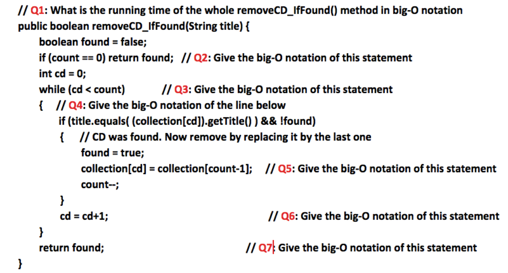

# Homework 7, Part A: Merge-Sorting a Linked List

In this assignment, we will walk you through implementing merge sort for a linked list.
In addition to the coding problems, we ask you to answer **open-response questions** and submit your answers in a file called `Answers.txt`.


<br/>


## Task 0: Creating your BlueJ project

Create a BlueJ project with the following starter code.

`LinearList.java`:
```java
public interface LinearList<T> {
    public boolean isEmpty();
    public int size();
    public T get(int position);
    public void insert(int position, T element);
    public T remove(int position);
    public String toString();
}
```

`LinearNode.java`:
```java
public class LinearNode<T> {
   private LinearNode<T> next;
   private T element;

   public LinearNode() {
      next = null;
      element = null;
   }

   public LinearNode(T elem) {
      next = null;
      element = elem;
   }

   public LinearNode<T> getNext() {
      return next;
   }

   public void setNext(LinearNode<T> node) {
      next = node;
   }

   public T getElement() {
      return element;
   }

   public void setElement(T elem) {
      element = elem;
   }
}
```

`LinkedList.java`:
```java
public class LinkedList<T> implements LinearList<T> {
    protected LinearNode<T> front;
    protected int count;
    
    public LinkedList() {
        this.front = null;
        this.count = 0;
    }
    
    public boolean isEmpty() {
        return this.count == 0;
    }
    
    public int size() {
        return this.count;
    }

    protected LinearNode<T> getNode(int position) {
        if (position < 0 || position >= this.count) {
            throw new RuntimeException(
                "Asking for element at index " + position 
                + " in a list of size" + this.count
            );
        }
        
        LinearNode<T> current = this.front;
        for (int i = 0; i < position; i++) {
            current = current.getNext();
        }
        
        return current;
    }
    
    public T get(int position) {
        LinearNode<T> node = this.getNode(position);
        if (node == null) {
            return null;
        }
        
        return node.getElement();
    }
    
    public void insert(int position, T element) {
        LinearNode<T> node = new LinearNode<T>(element);
        
        if (position == 0) {
            node.setNext(front);
            front = node;
        } else {
            LinearNode<T> before = this.getNode(position - 1);
            node.setNext(before.getNext());
            before.setNext(node);
        }
        
        this.count++;
    }
    
    public T remove(int position) {
        LinearNode<T> current;
        if (position == 0) {
            current = front;
            front = front.getNext();
        } else {
            LinearNode<T> before = this.getNode(position - 1);
            current = before.getNext();
            before.setNext(current.getNext());
        }  
        
        this.count--;
        return current.getElement();
    }

    public String toString() {
        String s = "[ ";
        
        LinearNode<T> current = this.front;
        for (int i = 0; i < this.size(); i++) {
            s += current.getElement().toString() + ", ";
            current = current.getNext();
        }
        
        return s + "]";
    }
}
```

Then, answer:
* Which instance variables/methods are `protected`?
* Why would we choose to make them `protected` instead of `private` for this assignment?


<br/>

## Task 1

**Instructions.** Create a class, `SortableLinkedList`, with the following header:

```java
public class SortableLinkedList<T extends Comparable<T>> extends LinkedList<T> {
  ...
}
```

This is the class in which you will implement your sortable linked list.

**Answer.**
* What does each part of the syntax in the class header mean?
* Why do we mention `Comparable<T>` in the class header?


<br/>

## Task 2

**Instructions.** Implement a helper method with the following header:
```java
private SortableLinkedList<T> split() {
  ...
}
```

This method cuts `this` linked list into two halves.
The left half should remain in `this`, while the right half should be returned as its own linked list.
This method should take no more than O(N) time.

**Tests.** After implementing this method, **test it** in the `main` method of the same file.
You can store the results of all of your testing in `SortableLinkedlistTesting.txt`.
We highly recommend you **do not** continue without confidence this method words correctly.


<br/>

## Task 3

**Instructions.** Implement a helper method with the following header:
```java
private void reverse() {
  ...
}
```

As the name suggests, this method should reverse the order of the nodes in the linked list.
This method should take no more than O(N) time.

**Hint.** You should be able to do this with a single while loop and without any additional data structures.
If you wish, you may use a Queue or Stack from the Java API (only using the appropriate methods).

**Tests.** As before, after implementing this method, **test it** in the `main` method of the same file.
We highly recommend you **do not** continue without confidence this method words correctly.


<br/>

## Task 4

**Instructions.** Implement a helper method with the following header:
```java
private void merge(SortableLinkedList<T> right) {
  ...
}
```

This method takes in a second linked list, `right`, and merges into `this` linked list, using merge-sort's merge algorithm.
This method should take no more than O(N) time.

**Hints.**
* You may want to create a **new linked list** to contain the merged elements. Then, you can assign its contents to `this`.
* You should do this **without** any pointer manipulation, only relying on other methods of the linked list.
* Consider using the helper methods you've already implemented.

**Tests.** As before, after implementing this method, **test it** in the `main` method of the same file.
We highly recommend you **do not** continue without confidence this method words correctly.


<br/>

## Task 5

**Instructions.** Finally, implement merge sort:
```java
public void sort() {
  ...
}
```

**Hint.** Every helper method above you haven't yet used will be helpful here.

**Tests.** Don't forget to test your sorting algorithm!
For ease of checking your code, you may want to sort something simple, like integers, instead of strings:
```
SortableLinkedList<Integer> l = new SortableLinkedList<Integer>();
l.insert(0, 0);
...
```


<br/>


# Submission Checklist

* You submitted **all** `.java` files and all `.txt` files.
* Your files are named **exactly** as in the homework specification, *including file extensions*.
* You tested **every possible** pathway in your code.
* You signed every class (or file) with `@author` and `@version`, accompanied by a description of what the class does.
* You wrote javadoc for every function, which includes `@param` and `@return`.
* You wrote inline comments explaining the logic of your code.


# Homework 7, Part B: While my guitar weeps

## Learning Goals

* Extend a known Data Structure (Queue), to create a new, special-purpose Data Structure (BoundedQueue)
* Use this special-purpose Data Structure in an simulation of a guitar playing music

## Exercise: While My Guitar Gently Weeps

In this exercise, you will learn how to simulate the plucking of a guitar string with the Karplus-Strong algorithm. Play the video below to see a visualization of the algorithm. If your browser won't play the video below, you can right-click on it and save it to your Desktop to play it from there.


<p><center>
<video controls="controls" width="760" height="220" name="Stairway to Heaven" src="_images/figs/StairwayToHeaven.mov"></video>
</center></p>

When a guitar string is plucked, the string vibrates and creates sound. The length of the string determines its fundamental frequency of vibration. We model a guitar string by sampling its displacement (a real number between -1/2 and +1/2) at N equally spaced points (in time), where N equals the sampling rate (44,100) divided by the fundamental frequency (rounding the quotient up to the nearest integer).

<!--
When a guitar string is plucked, the string vibrates and creates sound. These are some terms regarding the physics about how guitars make noise, and our simulation of it in this exercise:
* When a guitar string is at rest, it is at its **equilibrium position**.
* When a string is strummed, it vibrates oscillating from side to side. At any point, the distance of the string from its equilibrium position is called the **displacement** and it changes constantly. We will measure it as a real number between -1/2 and +1/2.
* The **sampling rate** indicates how many samples of the displacement we take in a second. In out simulation the sampling rate **(N)** will be 44,100 (samples per second).
* The **fundamental frequency** of the vibration is determined by the string length. We model a guitar string by dividing its displacement by the fundamental frequency (rounding the quotient up to the nearest integer). We will take N such samples per second.

 at **N** equally spaced points (in time), where **N** equals the **sampling rate** (44,100) divided by the fundamental frequency (rounding the quotient up to the nearest integer).
-->


**Plucking the string.** The excitation of the string contains energy at any frequency. We simulate the excitation with <em>white noise</em>:
set each of the <em>N</em> displacements to a random real number between -1/2 and +1/2.


**The resulting vibrations.** After the string is plucked, the string vibrates. The pluck causes a displacement which spreads wave-like over time. The Karplus-Strong algorithm simulates this vibration by maintaining a <em>bounded-queue</em> of the <em>N</em> samples: the algorithm repeatedly dequeues the first sample from the bounded queue and enqueues the average of the dequeued sample and the front sample in the queue, scaled by an <em>energy decay factor</em> of 0.994.


### Task 0

Download this [starting code](static_files/Guitar.zip) that will allow you to complete the tasks below.


### Task 1

Write a **BoundedQueue.java** class that implements a **bounded queue ADT**. A bounded queue is a queue with a **maximum capacity**: no elements can be enqueued when the queue is full to its capacity. The BoundedQueue class should *inherit* from the `javafoundations.CircularArrayQueue` class, given in the starting code.

Your *BoundedQueue.java* file should contain implementations for the following methods:

  * A **constructor** that takes an integer argument, which is the capacity of the bounded queue
  * A predicate `isFull()` that indicates whether the bounded queue is at capacity or not
  * An `enqueue()` method that overrides the `javafoundations.CircularArrayQueue`'s `enqueue()` method so that it only enqueues an element if the queue is not at capacity.

You should not add any more **instance** methods to this class implementation. But, of course, you should be providing evidence of testing your implementation in the `main()`.

Make sure you test this class before continuing to the next task.

### Task 2

Write a `GuitarString` class that models a vibrating guitar string according to the following contract:

  * <code>public GuitarString(double frequency);</code>
  The **constructor** creates a guitar string of the given *frequency*, using a sampling rate of 44,100. It initializes a bounded queue of the desired capacity *N* (sampling rate divided by the *frequency*, rounded up to the nearest integer), and fills the bounded queue with *N* zeros to model a guitar string at rest.<br>

  * <code>public void pluck();</code>
  The **pluck()** method replaces the *N* samples in the bounded queue with *N* random values between -0.5 and +0.5:<br>

  * <code>public double sample();</code>
  The **sample()** method returns the value of the item at the front of the bounded queue:<br>

  * <code>public void tic();</code>
  The **tic()** method applies the Karplus-Strong algorithm, i.e., it deletes the sample at the front of the bounded queue and adds to the end of the bounded queue the average of the deleted sample and the sample at the front of the bounded queue, multiplied by the energy decay factor of 0.994:


### Task 3

Now you should be ready to test your code from the previous tasks. Compile and run the provided **GuitarHeroine** application. If you have successfully completed the previous tasks, then when you run the application, a window should appear as follows:


Now, you can make sweet music. By pressing any of the keys on your computer keyboard corresponding to the notes as illustrated in the piano keyboard image, you can simulate plucking a guitar string for that note (make sure that your computer's sound is not muted).

### What to submit
In Gradescope submit the following files:

1. The `BoundedQueue.java` file
2. Your testing transcript (`BoundedQueue.txt`) for BoundedQueue class
3. The `GuitarString.java` file


<!--


# Homework 7, Part B: Big-O


Consider the following method that removes a CD from a linear collection (e.g. array):



Assume that the collection has `N` CDs to start with.
Please write the Big-O of every line marked in the code.
For lines inside a loop, please write the Big-O of the line, *accounting for its repetition*.
Write your answer in a text file called `BigO.txt` and submit it.

**Note:** If you find any of the questions ambiguous (that is, if you believe there are multiple interpretations), give your answer *for each interpretation*.


<br/>

# Homework 7, Part B: Trace Sorting by hand


## Learning Goals
* Gain a detailed understanding on how sorting algorithms work
* Working with best-known sorting algorithms

## Exercise: Trace Sorting Algorithms

Complete the following questions on paper by hand, scan them as a PDF, and submit as the file `SortingTrace.pdf` to Gradescope.

Given the following array of numbers:

`255 31 15 127 511 1023 63 7 2047`

Show a trace of execution for each of the sorting methods as shown in the book:

1. selection sort (listing 13.5, page 492)
2. insertion sort (listing 13.5, page 493)
3. merge sort (listing 13.5, page 495)

The meaning of **"trace"** depends on each sorting method.

* For selection sort, it means to display the contents of the array at every selection.
* For insertion sort, it means to display the contents of the array after each insertion.
* For mergesort, it means to draw the two trees that are created by splitting and merging.


## What to submit
* Make sure you title your paper and you write your name(s) on the document you are submitting.
* Create a PDF file named `SortingTrace.pdf` by scanning the completed worksheet and submit to Gradescope.


<br/>

# Submission Checklist

* You submitted **all** `.pdf` files and all `.txt` files.
* Your files are named **exactly** as in the homework specification, *including file extensions*.

-->
