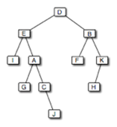

# Homework 8, Part A: Merge-Sorting a Linked List (paired)

In this assignment, we will walk you through implementing merge sort for a linked list.
In addition to the coding problems, we ask you to answer **open-response questions** and submit your answers in a file called `Answers.txt`.

For this task, you will choose your own partner!

<br/>


## Task 0: Creating your BlueJ project

Create a BlueJ project with the following starter code.

`LinearList.java`:
```java
public interface LinearList<T> {
    public boolean isEmpty();
    public int size();
    public T get(int position);
    public void insert(int position, T element);
    public T remove(int position);
    public String toString();
}
```

`LinearNode.java`:
```java
public class LinearNode<T> {
   private LinearNode<T> next;
   private T element;

   public LinearNode() {
      next = null;
      element = null;
   }

   public LinearNode(T elem) {
      next = null;
      element = elem;
   }

   public LinearNode<T> getNext() {
      return next;
   }

   public void setNext(LinearNode<T> node) {
      next = node;
   }

   public T getElement() {
      return element;
   }

   public void setElement(T elem) {
      element = elem;
   }
}
```

`LinkedList.java`:
```java
public class LinkedList<T> implements LinearList<T> {
    protected LinearNode<T> front;
    protected int count;
    
    public LinkedList() {
        this.front = null;
        this.count = 0;
    }
    
    public boolean isEmpty() {
        return this.count == 0;
    }
    
    public int size() {
        return this.count;
    }

    protected LinearNode<T> getNode(int position) {
        if (position < 0 || position >= this.count) {
            throw new RuntimeException(
                "Asking for element at index " + position 
                + " in a list of size" + this.count
            );
        }
        
        LinearNode<T> current = this.front;
        for (int i = 0; i < position; i++) {
            current = current.getNext();
        }
        
        return current;
    }
    
    public T get(int position) {
        LinearNode<T> node = this.getNode(position);
        if (node == null) {
            return null;
        }
        
        return node.getElement();
    }
    
    public void insert(int position, T element) {
        LinearNode<T> node = new LinearNode<T>(element);
        
        if (position == 0) {
            node.setNext(front);
            front = node;
        } else {
            LinearNode<T> before = this.getNode(position - 1);
            node.setNext(before.getNext());
            before.setNext(node);
        }
        
        this.count++;
    }
    
    public T remove(int position) {
        LinearNode<T> current;
        if (position == 0) {
            current = front;
            front = front.getNext();
        } else {
            LinearNode<T> before = this.getNode(position - 1);
            current = before.getNext();
            before.setNext(current.getNext());
        }  
        
        this.count--;
        return current.getElement();
    }

    public String toString() {
        String s = "[ ";
        
        LinearNode<T> current = this.front;
        for (int i = 0; i < this.size(); i++) {
            s += current.getElement().toString() + ", ";
            current = current.getNext();
        }
        
        return s + "]";
    }
}
```

Then, answer:
* Which instance variables/methods are `protected`?
* Why would we choose to make them `protected` instead of `private` for this assignment?


<br/>

## Task 1

**Instructions.** Create a class, `SortableLinkedList`, with the following header:

```java
public class SortableLinkedList<T extends Comparable<T>> extends LinkedList<T> {
  ...
}
```

This is the class in which you will implement your sortable linked list.

**Answer.**
* What does each part of the syntax in the class header mean?
* Why do we mention `Comparable<T>` in the class header?


<br/>

## Task 2

**Instructions.** Implement a helper method with the following header:
```java
private SortableLinkedList<T> split() {
  ...
}
```

This method cuts `this` linked list into two halves.
The left half should remain in `this`, while the right half should be returned as its own linked list.
This method should take no more than O(N) time.

**Tests.** After implementing this method, **test it** in the `main` method of the same file.
You can store the results of all of your testing in `SortableLinkedlistTesting.txt`.
We highly recommend you **do not** continue without confidence this method words correctly.


<br/>

## Task 3

**Instructions.** Implement a helper method with the following header:
```java
private void reverse() {
  ...
}
```

As the name suggests, this method should reverse the order of the nodes in the linked list.
This method should take no more than O(N) time.

**Hint.** You should be able to do this with a single while loop and without any additional data structures.
If you wish, you may use a Queue or Stack from the Java API (only using the appropriate methods).

**Tests.** As before, after implementing this method, **test it** in the `main` method of the same file.
We highly recommend you **do not** continue without confidence this method words correctly.


<br/>

## Task 4

**Instructions.** Implement a helper method with the following header:
```java
private void merge(SortableLinkedList<T> right) {
  ...
}
```

This method takes in a second linked list, `right`, and merges into `this` linked list, using merge-sort's merge algorithm.
This method should take no more than O(N) time.

**Hints.**
* You may want to create a **new linked list** to contain the merged elements. Then, you can assign its contents to `this`.
* You should do this **without** any pointer manipulation, only relying on other methods of the linked list.
* Consider using the helper methods you've already implemented.

**Tests.** As before, after implementing this method, **test it** in the `main` method of the same file.
We highly recommend you **do not** continue without confidence this method words correctly.


<br/>

## Task 5

**Instructions.** Finally, implement merge sort:
```java
public void sort() {
  ...
}
```

**Hint.** Every helper method above you haven't yet used will be helpful here.

**Tests.** Don't forget to test your sorting algorithm!
For ease of checking your code, you may want to sort something simple, like integers, instead of strings:
```
SortableLinkedList<Integer> l = new SortableLinkedList<Integer>();
l.insert(0, 0);
...
```


<br/>


# Submission Checklist

* You submitted **all** `.java` files and all `.txt` files.
* Your files are named **exactly** as in the homework specification, *including file extensions*.
* You tested **every possible** pathway in your code.
* You signed every class (or file) with `@author` and `@version`, accompanied by a description of what the class does.
* You wrote javadoc for every function, which includes `@param` and `@return`.
* You wrote inline comments explaining the logic of your code.


# Homework 8, Part B: Trees (individual)

## Exercise: Tree Terminology

This exercise tests your understanding of some definitions for trees. Consider the following tree:



1. Produce a preorder traversal of this tree.
2. Produce an inorder traversal of this tree.
3. Produce a postorder traversal of this tree.
4. Produce a level-order traversal of this tree.
5. Draw an array to represent this tree using the computed links implementation strategy.
6. Draw an array to represent this tree using the stored links implementation strategy. For this question, place the nodes in the array in alphabetical order.
Use -1 to denote the location of a child that does not exist.
7. What is the big-O time complexity of the find operation in the LinkedBinaryTree class?
8. What is the time complexity of the inorder operation in the LinkedBinaryTree class?


### What to submit

Submit to gradescope a single file, `TreeTerminology.pdf`, containing your answers.

<!--
# Homework 8, Part B: Tree Recursion
Learning Goals

    Practice recursive tree algorithms

Tasks

First, create a BlueJ project with the following starter code.

BTNode.java:

import java.util.LinkedList;

public class BTNode<T> {
    protected T element;
    protected BTNode<T> left, right;

    public BTNode(T elmt) {
        element = elmt;
        left = right = null;
    }

    public T getElement() { 
        return element; 
    }

    public void setElement(T element)
    { this.element = element; }

    public BTNode<T> getLeft() { 
        return left; 
    }

    public void setLeft(BTNode<T> left) { 
        this.left = left; 
    }

    public BTNode<T> getRight() { 
        return right; 
    }

    public void setRight(BTNode<T> right) {
        this.right = right; 
    }

    public BTNode<T> find(T target) {
        BTNode<T> result = null;

        if (element.equals(target)) {
            result = this;
        } else {
            if (left != null)
                result = left.find(target);
            if (result == null && right != null)
                result = right.find(target);
        }

        return result;
    }

    public int count() {
        int result = 1;

        if (left != null)
            result = result + left.count();

        if (right != null)
            result = result + right.count();

        return result;
    }

BSTNode.java:

public class BSTNode<T extends Comparable<T>> extends BTNode<T> {

    public BSTNode(T element) {
        super(element);
    }

    public void add(T item) {
        if (item.compareTo(element) < 0) {
            if (left == null)
                left = new BSTNode(item);
            else //  Add recursively 
                ((BSTNode) left).add(item);
        } else { //  item >= element, go right
            if (right == null)
                right = new BSTNode (item);
            else //  Add recursively 
                ((BSTNode) right).add (item);
        }
    }

    public BSTNode<T> find(T target) {
        if (target.compareTo(element) == 0)
            return this;
            
        // Since left and right are defined as BTNodes in the parent class,
        // we cast them to BSTNodes here so we can call compareTo
        BSTNode<T> l = (BSTNode<T>) left;
        BSTNode<T> r = (BSTNode<T>) right;
        
        if (target.compareTo(element) < 0 && l != null) {
            return l.find(target);
        }
            
        if (r != null) {
            return r.find(target);
        }
        
        return null;
    }
}

Next, implement the following instance methods:

    Implement public int countLeaves() in the BTNode class. This method should return an integer counting the number of leaves in tree.
    Implement public int countNodesAtLevel(int level) in the BTNode class. This method should return the number of nodes at a given level in the tree. In this method, we’ll say that level 0 represents the root.
    Implement public LinkedList<T> collectOnlyChildren() in the BTNode class. This method should return a list of all elements T that belong to nodes that have no siblings.
    Implement public boolean isValid() in the BSTNode class. This method should return true if the tree is a valid binary search tree.

Please test your code as you go, putting your test in a driver class called Driver.java.


Submission Checklist

    You submitted all .java files and all .txt files.
    Your files are named exactly as in the homework specification, including file extensions.
    You tested every possible pathway in your code.
    You signed every class (or file) with @author and @version, accompanied by a description of what the class does.
    You wrote javadoc for every function, which includes @param and @return.
    You wrote inline comments explaining the logic of your code.

--!>
<!--
# Homework 10, Part A: Hash Tables


## Goals
* Better understanding of using a Hash Table
* Designing a program on your own


## Exercise: Use Hashtables to analyze word frequencies

In this exercise, you will use a hash table to count frequencies of words in some files.


### Task 0 

Download the [DataFiles](static_files/DataFiles.zip) for testing your work.

### Task 1
Look at `WordTable_Hash.java` below. In the code, a hash table was used to count word frequencies in a single file. Go over the code, and make sure you understand it well before moving on. You should use parts of that code in the program you will write in the next step.

`WordTable_Hash.java`:
```java
import java.util.Hashtable;
import java.util.Scanner;
import java.util.Enumeration;
import java.io.File;
import java.io.IOException;

/* Read in a text file and store the number of occurrences of distinct word in the file.
 * You should use the file name and relative path as a command-line argument
 * E.g., "DataFiles/GreenEggs.txt"
 */
public class WordTable_Hash  {

    // Instance variables
    private int totalWords;
    private Hashtable<String, Integer> table;

    // Constructor
    public WordTable_Hash() {
        totalWords = 0;
        table = new Hashtable<String, Integer>();
    }

    // Instance methods
    public void readInFile(String filename) {
        try {
            Scanner reader = new Scanner(new File(filename));
            while (reader.hasNext()) {
                String word = reader.next();
                if (table.containsKey(word)) {
                    int previousCount = table.get(word);
                    table.put(word, previousCount+1);
                }
                else table.put(word, 1);
                totalWords++;
            }
            reader.close();
        } catch (IOException ex) {
            System.out.println(ex);
        }
    }

    public int getTotalWords() {
        return totalWords;
    }

    public int getNumDistinctWords() {
        return table.size();
    }

    public String toString() {
        return table.toString();
    }

    public void printKeysAndValues(){
        Enumeration contents = table.keys();
        String key;
        System.out.println("Key: \t Value: \n");
        while(contents.hasMoreElements()) {
            key = (String) contents.nextElement();
            System.out.println(key+ "\t" + table.get(key));
        }
    }

    public static void main (String[] args) throws IOException {
        if (args.length == 0)
            System.out.println("When executing this application, please enter the name of a file as a command line arguemnt.");
        else {
            long start = System.currentTimeMillis();
            WordTable_Hash wt = new WordTable_Hash();
            wt.readInFile(args[0]);
            long stop = System.currentTimeMillis();

            // Output results
            //System.out.println("The contents of the word frequency table are: ");
            //System.out.println(wt);
            System.out.println("Using WordTable_Hash");
            wt.printKeysAndValues(); // to enumerate them
            System.out.println("The file has " + wt.getTotalWords() + " words");
            System.out.println("of which " + wt.getNumDistinctWords() + " are different");
            System.out.println("Reading in file took " + (stop-start) + " milliseconds.");
        }
    } 
}
```


### Task 2
In this part, we will count word frequencies among multiple files, in particular all the files contained in a given directory (folder). The input of the program should be the name of a directory to be processed.
The output of the program should include:
* the total number of words read from **all files** in the given directory
* the number of distinct words in there, and
* the most frequent word among all files, together with its frequency.

You can iterate over the files in a directory like this:

```java
import java.io.File;

// args[0] is the name of a directory
dir= new File(args[0] + "/");

// dir points to the directory’s contents
File[]files= dir.listFiles();
System.out.println(files.length + "files");

for (File f : files) 
  if (!f.isHidden()) 
    process(f);
```    

The design of this program, i.e, what methods to have, what inputs they may take etc, is left up to you. As you design your application, remember some of the basic principals for writing code:
 * break your code into methods so that each method definition is not too long
 * code repetition (writing the some piece of code more than once) should be avoided
 * the `main()` method should be short, high-level and basically only call other methods
 * use descriptive names for methods, variables etc to improve the readability and the overall quality of your code


**Specifications:**
Please adhere to the following specifications:

* Name your program `WordFrequenciesDirectory_Hash.java`
* Your program should take the name of the folder to be processed as a **command line argument**. If no command line argument is provided by the user, the downloaded folder `DataFiles` should be used as input.
* Structure your output to look similar to this:

<pre>
Folder processed: DataFiles
Total number of words read: 1501990  
Number of distinct words: 60660
Most frequent word: the (frequency: 55965)
</pre>


### Task 3
Once you are done with the previous task, try to add some more functionality to your program:

Given a specific word, present the number of times it has repeated among all files in the directory processed by your program. Notice that it is left up to you how to get the "specific word" into your program.  Some ideas include:

* Hardwire it into your program
* Get it as (one more) command line argument
* Ask the user to type the word in the keyboard and read it into your program
* Perhaps, get in a dialogue with the user and allow them to enter, through the keyboard, more than
one such words.


### What to submit

 Submit to Gradescope your `WordFrequenciesDirectory_Hash.java` and your **testing transcript**  (running your program on the DataFiles directory you downloaded).


<br/>


-->


